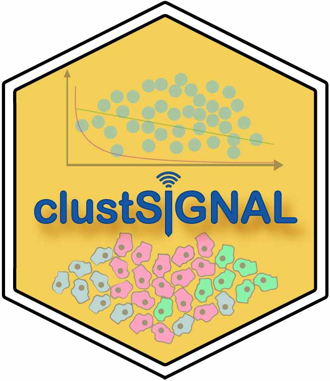

# ClustSIGNAL



ClustSIGNAL: ***Clust***ering of ***S***patially ***I***nformed ***G***ene expression with ***N***eighbourhood ***A***dapted ***L***earning.

An R package to perform spatially-resolved clustering on spatial transcriptomics data. Here, we calculate entropy as a measure of "domainness" of cell neighbourhoods and use it to generate weight distributions to perform adaptive smoothing of gene expression. Homogeneous neighbourhoods have low entropy, and so, smoothing is performed over more cells in these neighbourhoods. Contrarily, heterogeneous neighbourhoods have high entropy and are smoothed over a much smaller region. This approach not only overcomes data sparsity in the gene expression but also incorporates spatial context in the form of cell arrangement information from the neighbourhood. The resulting adaptively smoothed gene expression is used for downstream analyses like clustering.

For a tutorial on how to use ClustSIGNAL, see the vignette at this [website](https://sydneybiox.github.io/clustSIGNAL/).

## Installation

To install ClustSIGNAL via Bioconductor:

``` r
library(BiocManager)
BiocManager::install("clustSIGNAL")
```

To install ClustSIGNAL from [GitHub](https://github.com/SydneyBioX/clustSIGNAL):

``` r
# install.packages("devtools")
devtools::install_github("SydneyBioX/clustSIGNAL")
```

## Method description


**Figure: ClustSIGNAL method overview.**

Here, we present ClustSIGNAL, a spatial clustering method developed to handle data sparsity while considering the variability in cell arrangement of tissue regions. The core steps involved in the method are sequential:

**1.** The method starts with non-spatial clustering and subclustering (default louvain clustering) to classify cells into subclusters that we refer to as ‘putative cell type’ groups.

**2.** The neighbourhood of each cell is defined in terms of their ‘putative cell type’ group composition.

**3.** The cells in the neighbourhood are also sorted and rearranged so that the neighbours belonging to the same ‘putative cell type’ group as the index cell are placed closer to it.

**4.** Neighbourhood “domainness” is measured as entropy, where high entropy values indicate more heterogeneous neighbourhoods and low entropy values indicate more homogeneous neighbourhoods.

**5.** The entropy values are used to generate weight distributions specific to each neighbourhood.

**6.** The gene expressions of cells are adaptively smoothed using the entropy-guided weight distributions; cells in heterogeneous neighbourhoods (high entropy) undergo smoothing over a smaller region, whereas cells in homogeneous neighbourhoods (low entropy) undergo smoothing over a larger region.

**7.** Non-spatial clustering is performed with adaptively smoothed gene expression to generate ClustSIGNAL clusters that represent cell types.

## ClustSIGNAL parameters

The clustSIGNAL package uses a SpatialExperiment object as input. We provide users with a number of parameters to explore and experiment with, as well as prior tested default values for quick runs. clustSIGNAL can be used for single sample or multisample analysis with just one function call. Below is the list of the parameters offered and their possible values:

-   **spe** - SpatialExperiment object with cell [spatial coordinates](## "spatialCoords(spe)") matrix and [normalized counts](## "logcounts(spe)") of gene expression.

-   **samples** - column name in [cell metadata](## "colData(spe)") containing sample names.

-   **dimRed** - dimensionality reduction method name in [low embedding data](## "reducedDimNames(spe)"). Default value is "None", in which case PCA is calculated and used as low dimension data.

-   **batch** - whether batch correction should be performed. Default value is FALSE.

-   **batch_by** - column name in [cell metadata](## "colData(spe)") containing the groups by which to perform batch correction.

-   **NN** - neighbourhood size in terms of the number of nearest neighbours to consider. Value should be \> 1. Default value is 30.

-   **kernel** - type of weight distribution to use. Can be Gaussian (default) or exponential distribution.

-   **spread** - value of distribution parameter - standard deviation of Gaussian distribution or rate of exponential distribution. Default value is 0.05, recommended for Gaussian distribution. For exponential distribution, recommended value is 20.

-   **sort** - whether cell neighbourhoods should be sorted by their 'putative cell type' grouping. Default value is True.

-   **threads** - number of cpus to use for parallel runs. Default value is 1.

-   **outputs** - choice of output types. Default value is 'c' for a list containing data frame of cell IDs and cluster numbers. Other possible value are "n" for a list of for dataframe of clusters plus neighbourhood matrix, "s" for a list of dataframe of clusters plus final SpatialExperiment object, and "a" for a list of 3 outputs - cluster dataframe, neighbourhood matrix, and spe object.

-   **clustParams** - parameter options for TwoStepParam clustering methods in the bluster package. The clustering parameters are in the order - centers (centers) for clustering with KmeansParam, centers (centers) for sub-clustering clusters with KmeansParam, maximum iterations (iter.max) for clustering with KmeansParam, k values (k) for clustering with NNGraphParam, and community detection method (cluster.fun) to use with NNGraphParam.

## Running ClustSIGNAL

Before running ClustSIGNAL, it is important to ensure that the SpatialExperiment object input has spatial coordinates stored in the spatialCoords matrix. Otherwise, the method will throw an error asking the user to provide spatial coordinates.

``` r
# load required packages
library(clustSIGNAL)

data(example)

# Here, the cell labels are in the column 'uniqueID' and sample labels are in 'sample_id' column.
set.seed(100)
res <- clustSIGNAL(spe, samples = "sample_id", cells = "uniqueID", outputs = "a")
```
