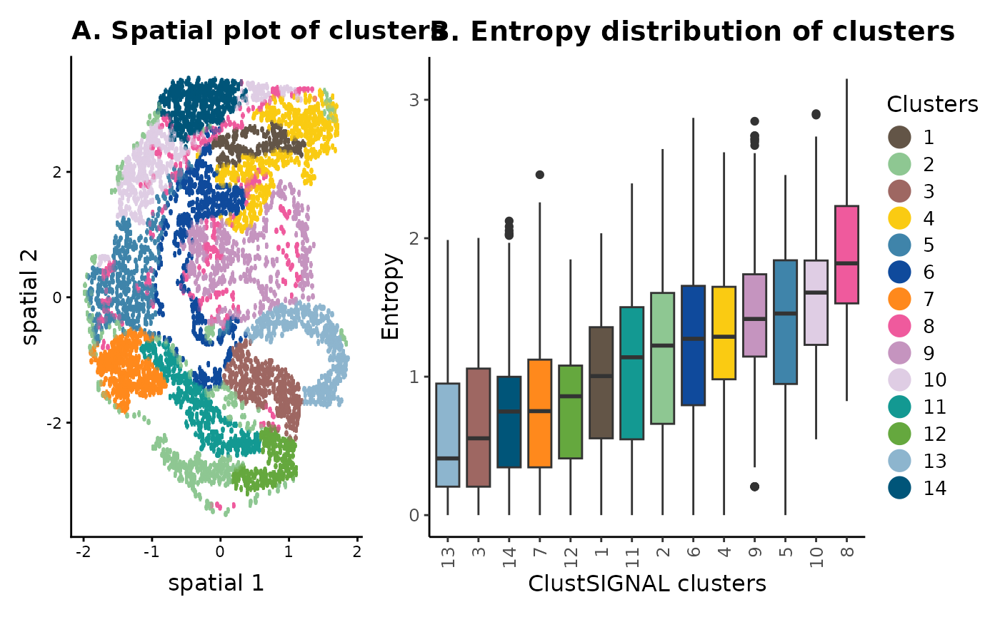
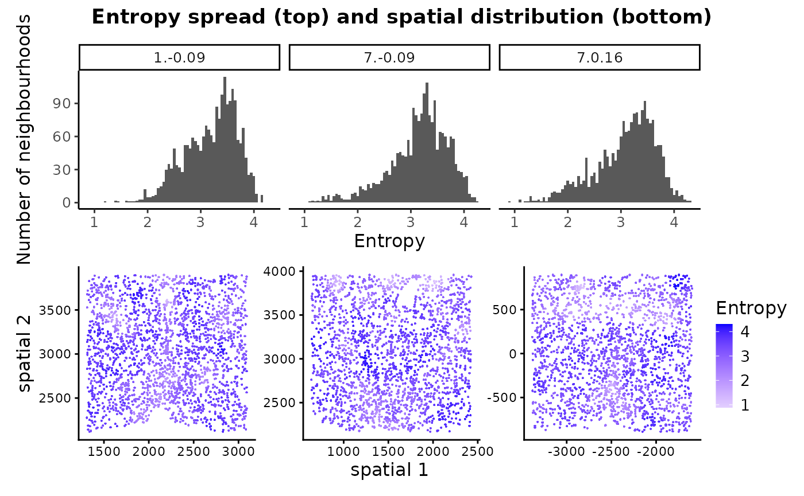

# ClustSIGNAL tutorial

## ClustSIGNAL

The R package ClustSIGNAL performs spatially-informed cell type
clustering on high-resolution spatial transcriptomics data. It uses both
the gene expression and spatial locations of cells to group them into
clusters.

### Motivation

ClustSIGNAL aims to: (i) overcome data sparsity using an adaptive
smoothing approach that is guided by the heterogeneity/homogeneity of
each individual cell’s neighbourhood; (ii) embed spatial context
information into the gene expression generating a transformed,
adaptively smoothed expression matrix that can be used for clustering;
and (iii) generate entropy data that captures the
heterogeneity/homogeneity information from each cell’s neighbourhood and
can be used to create a spatial map of heterogeneity distribution in a
sample tissue.

### Overview

In this vignette, we demonstrate how spatially-informed clustering can
be performed with ClustSIGNAL, assessing the clusters using pre-defined
metrics like [adjusted rand index
(ARI)](https://www.rdocumentation.org/packages/aricode/versions/0.1.1/topics/ARI)
and [normalized mutual information
(NMI)](https://www.rdocumentation.org/packages/aricode/versions/0.1.1/topics/NMI)
from the
[aricode](https://jmlr.csail.mit.edu/papers/volume11/vinh10a/vinh10a.pdf)
R package, as well as spatial plots to visualize them. ClustSIGNAL is a
multisample spatial clustering approach, and we show this using an
example dataset. We also display the use of entropy values, which are
generated as part of the ClustSIGNAL process, in understanding the
tissue structure of a sample.

ClustSIGNAL is very flexible in that it allows for, (i) user-provided
input values for most parameters (default parameter values are also
provided) and (ii) running ClustSIGNAL step-by-step. This tutorial
demonstrates how the step-by-step clustering can be performed, and what
parameters need to be defined at each step.

``` r
# load required packages
library(clustSIGNAL)
library(scater)
library(ggplot2)
library(dplyr)
library(patchwork)
library(aricode)
```

## Single sample analysis with ClustSIGNAL

In this section, we use the SeqFISH mouse embryo dataset from [Lohoff et
al, 2021](https://www.nature.com/articles/s41587-021-01006-2), which
contains spatial transcriptomics data from 3 mouse embryos, with 351
genes and 57,536 cells. For this vignette, we have subset the data by
randomly selecting 5000 cells from Embryo 2, excluding cells that had
been manually annotated as ‘Low quality’.

We begin by creating a SpatialExperiment object from the gene expression
and cell information in the data subset, ensuring that the spatial
coordinates are stored in spatialCoords within the SpatialExperiment
object. If the data are already in a SpatialExperiment object,
ClustSIGNAL can be run as long as basic requirements like spatial
coordinates, normalized counts, and unique cell names are met.

``` r
# load me_expr containing gene expression logcounts
# load me_data containing cell metadata including x-y coordinates
data(mEmbryo2)
# to create a SpatialExperiment object we need gene expression, cell metadata, 
# and cell locations.
spe <- SpatialExperiment::SpatialExperiment(
  assays = list(logcounts = me_expr), 
  colData = me_data,
  # spatialCoordsNames requires column names in me_data that contain 
  # xy-coordinates of cells
  spatialCoordsNames = c("X", "Y"))
spe
```

    ## class: SpatialExperiment 
    ## dim: 351 5000 
    ## metadata(0):
    ## assays(1): logcounts
    ## rownames(351): Abcc4 Acp5 ... Zfp57 Zic3
    ## rowData names(0):
    ## colnames(5000): embryo2_Pos29_cell100_z2 embryo2_Pos29_cell101_z5 ...
    ##   embryo2_Pos50_cell97_z5 embryo2_Pos50_cell99_z5
    ## colData names(4): uniqueID pos celltype_mapped_refined sample_id
    ## reducedDimNames(0):
    ## mainExpName: NULL
    ## altExpNames(0):
    ## spatialCoords names(2) : X Y
    ## imgData names(0):

For running ClustSIGNAL, we need to know the column name in colData slot
of the SpatialExperiment object that contains the sample labels. Here,
the sample labels are in the ‘sample_id’ column.

``` r
spe |> colData() |> colnames() # column names in the metadata
```

    ## [1] "uniqueID"                "pos"                    
    ## [3] "celltype_mapped_refined" "sample_id"

### Running ClustSIGNAL on one sample

The simplest ClustSIGNAL run requires a SpatialExperiment object, the
colData column name of sample labels, and the type of output to
generate.

Other parameters that can be modified include: (i) dimRed - specifies
the low dimension data to use (default ‘None’); (ii) batch - when TRUE,
ClustSIGNAL performs batch correction and needs a valid value for
batch_by; (iii) batch_by - name of metadata column containing sample
batches contributing to batch effect (default ‘None’); (iv) NN -
specifies the neighbourhood size (default 30); (v) kernel - specifies
the distribution to use for weight generation (default ‘G’ for
Gaussian); (vi) spread - the distribution spread value (default 0.3 for
Gaussian); (vii) sort - when TRUE, ClustSIGNAL sorts the neighbourhood;
(viii) threads - specifies the number of cpus to use in parallel runs
(default 1); and (ix) clustParams - list of parameters to use for
non-spatial clustering components.

Furthermore, the adaptively smoothed gene expression data generated by
ClustSIGNAL could be useful for other downstream analyses and is
accessible if the output options ‘s’ or ‘a’ are selected to return the
final SpatialExperiment object.

``` r
set.seed(100)
samples <- "sample_id" # column name containing sample names
# to run ClustSIGNAL, requires a SpatialExperiment object, column name of sample
# labels in colData slot, and the output type to generate (clusters, neighbours,
# and/or final spe object).
res_emb <- clustSIGNAL(spe, samples, outputs = "a") 
```

    ## [1] "Calculating PCA. Time 01:12:39"
    ## [1] "ClustSIGNAL run started. Time 01:12:40"
    ## [1] "Initial nonspatial clustering performed. Clusters = 9 Time 01:12:41"
    ## [1] "Nonspatial subclustering performed. Subclusters = 31 Time 01:12:43"
    ## [1] "Regions defined. Time 01:12:45"
    ## [1] "Region heterogeneity calculated. Time 01:12:45"
    ## [1] "Smoothing performed. NN = 30 Kernel = G Spread = 0.3 Time 01:12:45"
    ## [1] "Nonspatial clustering performed on smoothed data. Clusters = 14 Time 01:12:47"
    ## [1] "ClustSIGNAL run completed. 01:12:47"
    ## Time difference of 8.100904 secs

This returns a list that contains a ClustSIGNAL clusters dataframe
(clusters), a matrix of cell IDs from each cell’s neighbourhood
(neighbours with NN neighbourhood size), and a final SpatialExperiment
object (spe_final).

``` r
res_emb |> names() # names of the outputs generated
```

    ## [1] "clusters"   "neighbours" "spe_final"

The cluster dataframe contains cell IDs and their cluster labels
assigned by ClustSIGNAL.

``` r
res_emb$clusters |> head() # cluster data frame has cell IDs and cluster labels
```

    ##                      Cells Clusters
    ## 1 embryo2_Pos29_cell100_z2       12
    ## 2 embryo2_Pos29_cell101_z5       12
    ## 3 embryo2_Pos29_cell104_z2       12
    ## 4 embryo2_Pos29_cell104_z5       12
    ## 5 embryo2_Pos29_cell105_z2       12
    ## 6 embryo2_Pos29_cell108_z5       12

The output SpatialExperiment object contains the adaptively smoothed
gene expression data as an additional assay (smoothed), as well as
initial clusters and subclusters, entropy values, and ClustSIGNAL
clusters.

``` r
# for convenience with downstream analyses, we will replace the original spe
# object with the one generated by ClustSIGNAL. This does not lead to any loss 
# of information as ClustSIGNAL only adds information to the input spe object.
spe <- res_emb$spe_final
spe
```

    ## class: SpatialExperiment 
    ## dim: 351 5000 
    ## metadata(0):
    ## assays(2): logcounts smoothed
    ## rownames(351): Abcc4 Acp5 ... Zfp57 Zic3
    ## rowData names(0):
    ## colnames(5000): embryo2_Pos29_cell100_z2 embryo2_Pos29_cell101_z5 ...
    ##   embryo2_Pos50_cell97_z5 embryo2_Pos50_cell99_z5
    ## colData names(8): uniqueID pos ... entropy ClustSIGNAL
    ## reducedDimNames(2): PCA PCA.smooth
    ## mainExpName: NULL
    ## altExpNames(0):
    ## spatialCoords names(2) : X Y
    ## imgData names(1): sample_id

``` r
spe |> colData() |> colnames()
```

    ## [1] "uniqueID"                "pos"                    
    ## [3] "celltype_mapped_refined" "sample_id"              
    ## [5] "initCluster"             "initSubcluster"         
    ## [7] "entropy"                 "ClustSIGNAL"

### Visualising ClustSIGNAL clusters

We use spatial coordinates of cells and their ClustSIGNAL cluster labels
and entropy values to visualize the clustering output.

``` r
colors <- c("#635547", "#8EC792", "#9e6762", "#FACB12", "#3F84AA", "#0F4A9C", 
            "#ff891c", "#EF5A9D", "#C594BF", "#DFCDE4", "#139992", "#65A83E", 
            "#8DB5CE", "#005579", "#C9EBFB", "#B51D8D", "#532C8A", "#8870ad", 
            "#cc7818", "#FBBE92", "#EF4E22", "#f9decf", "#c9a997", "#C72228", 
            "#f79083", "#F397C0", "#DABE99", "#c19f70", "#354E23", "#C3C388",
            "#647a4f", "#CDE088", "#f7f79e", "#F6BFCB", "#7F6874", "#989898", 
            "#1A1A1A", "#FFFFFF", "#e6e6e6", "#77441B", "#F90026", "#A10037", 
            "#DA5921", "#E1C239", "#9DD84A")
```

``` r
# for plotting with scater R package, we need to add the spatial coordinates 
# to the reduced dimension slot of the spe object
reducedDim(spe, "spatial") <- spatialCoords(spe)
```

``` r
# spatial plot
spt_clust <- scater::plotReducedDim(
  spe, colour_by = "ClustSIGNAL", dimred = "spatial", point_alpha = 1,
  point_size = 4, scattermore = TRUE) +
  ggtitle("A. Spatial plot of clusters") +
  scale_color_manual(values = colors) +
  guides(colour = guide_legend(title = "Clusters", 
                               override.aes = list(size = 5))) +
  theme(text = element_text(size = 12))
```

    ## Scale for colour is already present.
    ## Adding another scale for colour, which will replace the existing scale.

``` r
# entropy distribution plotted at cluster-level can indicate which clusters 
# have cells from homogeneous/heterogeneous space. 
df_met <- spe |> colData() %>% as.data.frame()
ct_ent <- df_met %>% 
  mutate(ClustSIGNAL = as.character(ClustSIGNAL)) %>%
  group_by(ClustSIGNAL) %>%
  # calculating median entropy of each cluster category
  summarise(mdEntropy = median(entropy)) %>% 
  # reordering clusters by their median entropy value
  arrange(mdEntropy)
df_met$ClustSIGNAL <- factor(df_met$ClustSIGNAL, levels = ct_ent$ClustSIGNAL)
col_ent <- colors[as.numeric(as.character(ct_ent$ClustSIGNAL))]
box_clust <- df_met %>%
  ggplot(aes(x = ClustSIGNAL, y = entropy, fill = ClustSIGNAL)) +
  geom_boxplot() +
  scale_fill_manual(values = col_ent) +
  ggtitle("B. Entropy distribution of clusters") +
  labs(x = "ClustSIGNAL clusters", y = "Entropy", name = "Clusters") +
  theme_classic() +
  theme(legend.position = "none",
        text = element_text(size = 12),
        axis.text.x = element_text(angle = 90, vjust = 0.5, hjust = 1),
        plot.title = element_text(face = "bold"))
```

``` r
spt_clust + box_clust + patchwork::plot_layout(guides = "collect", 
                                               widths = c(2, 3))
```

    ## Ignoring unknown labels:
    ## • name : "Clusters"



The spatial location and entropy distribution of the clusters provide
spatial context of the cells and their neighbourhoods, as well as the
compositions of the neighbourhoods. For example, in panel (B) the low
entropy clusters are generally found in space that is more homogeneous,
whereas the high entropy clusters belong to neighbourhoods that have
more cell diversity. This can also be visualized in the spatial plot in
panel (A).

### Assessing clustering accuracy

We assess the clustering efficiency of ClustSIGNAL using the commonly
used clustering metrics ARI and NMI, which are usable only when prior
cell annotations are available. Here, ARI and NMI measure the similarity
or agreement (respectively) between cluster labels obtained from
ClustSIGNAL and manual cell annotations.

``` r
# to assess the accuracy of clustering, the cluster labels are often compared to
# prior annotations. Here, we compare ClustSIGNAL cluster labels to annotations 
# available with this public data.
spe |> colData() %>% 
  as.data.frame() %>%
  summarise(
    ARI = aricode::ARI(celltype_mapped_refined, ClustSIGNAL), # calculate ARI
    NMI = aricode::NMI(celltype_mapped_refined, ClustSIGNAL)) # calculate NMI
```

    ##         ARI       NMI
    ## 1 0.3117711 0.5663197

### Entropy spread and distribution

The entropy values generated through ClustSIGNAL process can be useful
in analyzing the sample structure.

``` r
# we can assess the overall entropy distribution of the dataset
spe |> colData() %>% 
  as.data.frame() %>%
  summarise(min_Entropy = min(entropy),
            min_Entropy_count = sum(spe$entropy == 0),
            max_Entropy = max(entropy),
            mean_Entropy = mean(entropy))
```

    ##   min_Entropy min_Entropy_count max_Entropy mean_Entropy
    ## 1           0               382      3.1518     1.119852

The entropy range can indicate whether the tissue sample contains any
homogeneous regions. For example, a min_Entropy of 0 means that some
cells are placed in completely homogeneous space when looking at a
neighbourhood size of 30 cells (NN = 30 was used for generating the
entropy values). The min_Entropy_count gives us an idea of the total
number of such low entropy neighbourhoods in the sample.

``` r
# we can also visualize the distribution and spread of the entropy values
hst_ent <- spe |> colData() %>% 
  as.data.frame() %>%
  ggplot(aes(entropy)) +
  geom_histogram(binwidth = 0.05) +
  ggtitle("A. Entropy spread") +
  labs(x = "Entropy", y = "Number of neighbourhoods") +
  theme_classic() +
  theme(text = element_text(size = 12),
        plot.title = element_text(face = "bold"))
```

``` r
spt_ent <- scater::plotReducedDim(spe, colour_by = "entropy",
                                    # specify spatial low dimension
                                    dimred = "spatial", point_alpha = 1,
                                    point_size = 4, scattermore = TRUE) +
  ggtitle("B. Entropy spatial distribution") +
  scale_colour_gradient2("Entropy", low = "grey", high = "blue") +
  scale_size_continuous(range = c(0, max(spe$entropy))) +
  theme(text = element_text(size = 12))
```

    ## Scale for colour is already present.
    ## Adding another scale for colour, which will replace the existing scale.

``` r
hst_ent + spt_ent
```


The spread and spatial distribution of neighbourhood entropies can be
useful in visually assessing and comparing tissue compositions in
samples - low entropy neighbourhoods are more homogeneous and likely
contain cell type-specific niches, whereas high entropy neighbourhoods
are heterogeneous with more uniform distribution of different cell
types.

## Multisample analysis with ClustSIGNAL

Here, we use the MERFISH mouse hypothalamus preoptic region dataset from
[Moffitt et al,
2018](https://www.science.org/doi/10.1126/science.aau5324), which
contains spatial transcriptomics data from 181 samples, with 155 genes
and 1,027,080 cells. For this vignette, we have subset the data by
selecting 6000 random cells from only 3 samples - Animal 1 Bregma -0.09
(2080 cells), Animal 7 Bregma 0.16 (1936 cells), and Animal 7 Bregma
-0.09 (1984 cells), excluding cells that were manually annotated as
‘Ambiguous’ and 20 genes for which expression was generated using a
different technology.

We start the analysis by creating a SpatialExperiment object from the
gene expression and cell information in the data subset, ensuring that
the spatial coordinates are stored in spatialCoords slot within the spe
object.

``` r
# load mh_expr containing gene expression logcounts
# load mh_data containing cell metadata and cell x-y coordinates
data(mHypothal)
# create spe object using gene expression, cell metadata, and cell locations
spe2 <- SpatialExperiment(assays = list(logcounts = mh_expr), 
                          colData = mh_data,
                          # spatialCoordsNames requires column names in 
                          # mh_data that contain xy-coordinates of cells
                          spatialCoordsNames = c("X", "Y"))
spe2
```

    ## class: SpatialExperiment 
    ## dim: 135 6000 
    ## metadata(0):
    ## assays(1): logcounts
    ## rownames(135): Ace2 Adora2a ... Ttn Ttyh2
    ## rowData names(0):
    ## colnames(6000): 74d3f69d-e8f2-4c33-a8ca-fac3eb65e55a
    ##   41158ddc-e70c-487b-b891-0cb3c8452555 ...
    ##   54145623-7071-482c-b9da-d0d2dd31274a
    ##   96bc85ce-b993-4fb1-8e0c-165f83f0cfd0
    ## colData names(4): Cell_ID Cell_class sample_id samples
    ## reducedDimNames(0):
    ## mainExpName: NULL
    ## altExpNames(0):
    ## spatialCoords names(2) : X Y
    ## imgData names(0):

Next we identify sample labels column in the SpatialExperiment object.

``` r
spe2 |> colData() |> str() # metadata summary
```

    ## Formal class 'DFrame' [package "S4Vectors"] with 6 slots
    ##   ..@ rownames       : chr [1:6000] "74d3f69d-e8f2-4c33-a8ca-fac3eb65e55a" "41158ddc-e70c-487b-b891-0cb3c8452555" "46ba8016-2c4f-4ef0-84c9-3ee3951afdfd" "ac9f1af8-8b03-4b2f-b29c-929ae2b240dc" ...
    ##   ..@ nrows          : int 6000
    ##   ..@ elementType    : chr "ANY"
    ##   ..@ elementMetadata: NULL
    ##   ..@ metadata       : list()
    ##   ..@ listData       :List of 4
    ##   .. ..$ Cell_ID   : chr [1:6000] "74d3f69d-e8f2-4c33-a8ca-fac3eb65e55a" "41158ddc-e70c-487b-b891-0cb3c8452555" "46ba8016-2c4f-4ef0-84c9-3ee3951afdfd" "ac9f1af8-8b03-4b2f-b29c-929ae2b240dc" ...
    ##   .. ..$ Cell_class: chr [1:6000] "Endothelial 1" "Endothelial 1" "Pericytes" "Astrocyte" ...
    ##   .. ..$ sample_id : chr [1:6000] "sample01" "sample01" "sample01" "sample01" ...
    ##   .. ..$ samples   : Factor w/ 3 levels "1.-0.09","7.-0.09",..: 1 1 1 1 1 1 1 1 1 1 ...

Here, the sample labels are in the ‘samples’ column of the object.

### ClustSIGNAL run

An important concept to take into account when running multisample
analysis is batch effects. When gathering samples from different sources
or through different technologies/procedures, some technical batch
effects might be introduced into the dataset. We can run ClustSIGNAL in
batch correction mode simply by setting batch = TRUE and batch_by =
“group”, where group will be the name of the colData column of spe
object that contains the batch information. ClustSIGNAL then uses
[harmony](https://portals.broadinstitute.org/harmony/) internally for
batch correction.

``` r
set.seed(110)
# ClustSIGNAL can be run on a dataset with multiple samples. As before, we need
# the SpatialExperiment object and column name of sample labels in the object. 
# The method can be run in parallel through the threads option. Here we use 
# thread = 4 to use 4 cores.
# Since no batch effects were observed in this data subset, we have not used 
# the batch and batch_by options.
samples <- "samples" # column name containing sample names
res_hyp <- clustSIGNAL(spe2, samples, threads = 4, outputs = "a")
```

    ## [1] "Calculating PCA. Time 01:12:51"
    ## [1] "ClustSIGNAL run started. Time 01:12:51"
    ## [1] "Initial nonspatial clustering performed. Clusters = 9 Time 01:12:52"
    ## [1] "Nonspatial subclustering performed. Subclusters = 38 Time 01:12:54"
    ## [1] "Regions defined. Time 01:12:57"
    ## [1] "Region heterogeneity calculated. Time 01:12:59"
    ## [1] "Smoothing performed. NN = 30 Kernel = G Spread = 0.3 Time 01:12:59"
    ## [1] "Nonspatial clustering performed on smoothed data. Clusters = 12 Time 01:13:00"
    ## [1] "ClustSIGNAL run completed. 01:13:00"
    ## Time difference of 8.925673 secs

``` r
# for convenience with downstream analyses, we replace the original spe object 
# with the one generated by ClustSIGNAL.
spe2 <- res_hyp$spe_final
spe2
```

    ## class: SpatialExperiment 
    ## dim: 135 6000 
    ## metadata(0):
    ## assays(2): logcounts smoothed
    ## rownames(135): Ace2 Adora2a ... Ttn Ttyh2
    ## rowData names(0):
    ## colnames(6000): 74d3f69d-e8f2-4c33-a8ca-fac3eb65e55a
    ##   41158ddc-e70c-487b-b891-0cb3c8452555 ...
    ##   54145623-7071-482c-b9da-d0d2dd31274a
    ##   96bc85ce-b993-4fb1-8e0c-165f83f0cfd0
    ## colData names(8): Cell_ID Cell_class ... entropy ClustSIGNAL
    ## reducedDimNames(2): PCA PCA.smooth
    ## mainExpName: NULL
    ## altExpNames(0):
    ## spatialCoords names(2) : X Y
    ## imgData names(1): sample_id

### Clustering metrics

Clustering and entropy results can be calculated and visualized for each
sample.

``` r
samplesList <- spe2[[samples]] |> levels() # get sample names
samplesList
```

    ## [1] "1.-0.09" "7.-0.09" "7.0.16"

``` r
spe2 |> colData() %>% 
  as.data.frame() %>%
  group_by(samples) %>%
  summarise(
    # Comparing ClustSIGNAL cluster labels to annotations available with the 
    # public data to assess its accuracy.
    ARI = aricode::ARI(Cell_class, ClustSIGNAL),
    NMI = aricode::NMI(Cell_class, ClustSIGNAL),
    # Assessing the overall entropy distribution of the samples in the dataset.
    min_Entropy = min(entropy),
    min_Entropy_count = sum(entropy == 0),
    max_Entropy = max(entropy),
    mean_Entropy = mean(entropy))
```

    ## # A tibble: 3 × 7
    ##   samples   ARI   NMI min_Entropy min_Entropy_count max_Entropy mean_Entropy
    ##   <fct>   <dbl> <dbl>       <dbl>             <int>       <dbl>        <dbl>
    ## 1 1.-0.09 0.381 0.513       1.19                  0        4.17         3.19
    ## 2 7.-0.09 0.398 0.555       1.08                  0        4.24         3.15
    ## 3 7.0.16  0.587 0.613       0.883                 0        4.31         3.08

As before, the entropy range can tell us a lot about the tissue
structure of the samples. Unlike the seqFISH subset data, where the
minimum entropy of the sample was 0, here, the minimum entropy is higher
indicating that the tissue doesn’t really have any cell type-specific
niches when looking at neighbourhood size of 30 cells. Moreover, the
relatively high mean entropy value indicates that the tissues slices are
quite heterogeneous.

### Visualizing ClustSIGNAL clusters

ClustSIGNAL performs clustering on all cells in the dataset in one run,
thereby generating the same clusters across multiple samples. The
cluster labels do not need to be mapped between samples. For example,
cluster 1 represents the same cell type in all three samples, without
needing explicit mapping between samples.

``` r
# for plotting with scater R package, we need to add the spatial coordinates 
# to the reduced dimension section
reducedDim(spe2, "spatial") <- spatialCoords(spe2)
```

``` r
# spatial plot - ClustSIGNAL clusters
spt_clust2 <- scater::plotReducedDim(spe2, colour_by = "ClustSIGNAL",
                                    # specify spatial low dimension
                                    dimred = "spatial", point_alpha = 1,
                                    point_size = 4, scattermore = TRUE) +
  scale_color_manual(values = colors) +
  facet_wrap(vars(spe2[[samples]]), scales = "free", nrow = 1) +
  guides(colour = guide_legend(title = "Clusters",
                               override.aes = list(size = 3))) +
  theme(text = element_text(size = 12))
```

    ## Scale for colour is already present.
    ## Adding another scale for colour, which will replace the existing scale.

``` r
# For visualising cluster-level entropy distribution, we reorder the clusters 
# by their median entropy value in each sample
df_met2 <- spe2 |> colData() %>% as.data.frame()

box_clust2 <- list()
for (s in samplesList) {
  df_met_sub <- df_met2[df_met2[[samples]] == s, ]
  # calculating median entropy of each cluster in a sample
  ct_ent2 <- df_met_sub %>%
    mutate(ClustSIGNAL = as.character(ClustSIGNAL)) %>%
    group_by(ClustSIGNAL) %>%
    summarise(mdEntropy = median(entropy)) %>%
    # reordering clusters by their median entropy
    arrange(mdEntropy)
  
  df_met_sub$ClustSIGNAL <- factor(df_met_sub$ClustSIGNAL, 
                                   levels = ct_ent2$ClustSIGNAL)
  # box plot of cluster entropy
  col_ent2 <- colors[as.numeric(ct_ent2$ClustSIGNAL)]
  box_clust2[[s]] <- df_met_sub %>%
    ggplot(aes(x = ClustSIGNAL, y = entropy, fill = ClustSIGNAL)) +
    geom_boxplot() +
    scale_fill_manual(values = col_ent2) +
    facet_wrap(vars(samples), nrow = 1) +
    labs(x = "ClustSIGNAL clusters", y = "Entropy") +
    ylim(0, NA) +
    theme_classic() +
    theme(strip.text = element_blank(),
          legend.position = "none",
          text = element_text(size = 12),
          axis.text.x = element_text(angle = 90, vjust = 0.5))
}
```

``` r
spt_clust2 / (patchwork::wrap_plots(box_clust2[1:3], nrow = 1) +
                plot_layout(axes = "collect")) +
  plot_layout(guides = "collect", heights = c(5, 3)) +
  plot_annotation(
    title = "Spatial (top) and entropy (bottom) distributions of clusters",
    theme = theme(plot.title = element_text(hjust = 0.5, face = "bold")))
```


The spatial location and entropy distribution of the clusters can be
compared in a multisample analysis, providing spatial context of the
cluster cells and their neighbourhood compositions in the different
samples within the dataset. Since the clusters were generated in a
single run, they are same across the different samples. Therefore, if a
cluster is not represented in a sample, this would mean that its
respective cell type is not present in that sample.

### Visualising entropy spread and distribution

In multisample analysis, tissue structure of the different samples in
the dataset can be compared using the spread and spatial distribution of
the neighbourhood entropy measures.

``` r
hst_ent2 <- spe2 |> colData() %>% 
  as.data.frame() %>%
  ggplot(aes(entropy)) +
  geom_histogram(binwidth = 0.05) +
  facet_wrap(vars(samples), nrow = 1) +
  labs(x = "Entropy", y = "Number of neighbourhoods") +
  theme_classic() +
  theme(text = element_text(size = 12))
```

``` r
spt_ent2 <- scater::plotReducedDim(spe2, colour_by = "entropy",
                                  # specify spatial low dimension
                                  dimred = "spatial", point_alpha = 1,
                                  point_size = 4, scattermore = TRUE) +
  scale_colour_gradient2("Entropy", low = "grey", high = "blue") +
  scale_size_continuous(range = c(0, max(spe2$entropy))) +
  facet_wrap(vars(spe2[[samples]]), scales = "free", nrow = 1) +
  theme(strip.text = element_blank(),
        text = element_text(size = 12))
```

    ## Scale for colour is already present.
    ## Adding another scale for colour, which will replace the existing scale.

``` r
hst_ent2 / spt_ent2 + plot_layout(heights = c(4, 5)) +
    plot_annotation(
      title = "Entropy spread (top) and spatial distribution (bottom)",
      theme = theme(plot.title = element_text(hjust = 0.5, face = "bold")))
```



Together, these plots help in visually assessing tissue compositions of
the samples - all 3 samples have high entropy neighbourhoods indicating
that they mainly have heterogeneous regions with uniform distribution of
different cell types.

## ClustSIGNAL step-by-step run

ClustSIGNAL has five main functions for each distinct step in its
algorithm. These functions are accessible and can be run sequentially to
generate data from intermediate steps, if needed. For example,
ClustSIGNAL can be run step-by-step up to the entropy measurement
component, without having to run the complete method. The entropy values
will be added to the SpatialExperiment object and can be used for
assessing tissue structure in terms of its heterogeneity. Similarly, the
adaptively smoothed gene expression can be obtained by running
ClustSIGNAL till the adaptive smoothing step. Here, we describe how
individual ClustSIGNAL functions can be used sequentially.

``` r
# load logcounts and metadata to the environment
data(mEmbryo2)

# as before, we read the data into a SpatialExperiment object
spe <- SpatialExperiment(assays = list(logcounts = me_expr),
                         colData = me_data, spatialCoordsNames = c("X", "Y"))
```

``` r
set.seed(100)
# first we need to generate low dimension data for initial clustering
spe <- scater::runPCA(spe) 
```

### Step 1: Initial clustering and subclustering

The first step in the ClustSIGNAL algorithm is initial clustering and
subclustering. For this, we need to provide a spe object with low
embedding information.

Other parameters have default values: batch = FALSE and batch_by =
“None” (if no batch correction needs to be performed), threads = 1,
clustParams = list(clust_c = 0, subclust_c = 0, iter.max = 30, k = 10,
cluster.fun = “louvain”).

Among the clustering parameters, clust_c and subclust_c refer to the
number of centers to use for clustering and sub-clustering with
KmeansParam. By default clust_c is set to 0, in which case the method
uses either 5000 centers or 1/5th of the total cells in the data as the
number of centers, whichever is lower. Similarly, subclust_c is set to 0
by default, in which case the method uses either 1 center or half of the
total cells in the initial cluster as the number of centers, whichever
is higher. For all other values of clust_c and subclust_c, the input is
treated as the number of centers.

``` r
spe <- clustSIGNAL::p1_clustering(spe, dimRed = "PCA")
```

    ## [1] "Initial nonspatial clustering performed. Clusters = 9 Time 01:13:08"
    ## [1] "Nonspatial subclustering performed. Subclusters = 31 Time 01:13:09"

Here, two columns are added to the spe object under the cell metadata:

1.  the initial cluster labels,

``` r
spe$initCluster |> head() # clustering output
```

    ## [1] 7 7 7 7 3 7
    ## Levels: 1 2 3 4 5 6 7 8 9

2.  the initial subcluster labels.

``` r
spe$initSubcluster |> head() # subclustering output
```

    ## embryo2_Pos29_cell100_z2 embryo2_Pos29_cell101_z5 embryo2_Pos29_cell104_z2 
    ##                      7.1                      7.1                      7.1 
    ## embryo2_Pos29_cell104_z5 embryo2_Pos29_cell105_z2 embryo2_Pos29_cell108_z5 
    ##                      7.1                      3.3                      7.1 
    ## 31 Levels: 1.1 1.2 1.3 2.1 2.2 2.3 2.4 3.1 3.2 3.3 4.1 4.2 4.3 4.4 5.1 ... 9.4

### Step 2: Neighbourhood detection

The next step involves detecting the neighborhood of all cells. We need
the spe object containing the initial cluster and initial subcluster
labels and sample IDs for this.

By default, ClustSIGNAL identifies 30 nearest neighbors (NN = 30), sorts
the neighbourhood (sort = TRUE), and does not use parallel runs (threads
= 1).

ClustSIGNAL allows the use of external cell labels generated through
other methods, in place of the initial clusters and subclusters. For
this, the cell cluster and subcluster labels of each cell must be stored
in the colData of the spe object as “initCluster” and “initSubcluster”,
respectively.

``` r
# This step generates a list of neighbourhood information.
outReg <- clustSIGNAL::neighbourDetect(spe, samples = "sample_id")
```

    ## [1] "Regions defined. Time 01:13:12"

This generates a list containing:

1.  a neighborhood matrix containing cell IDs,

``` r
outReg$nnCells[1:3, 1:3]
```

    ##                          [,1]                       [,2]                      
    ## embryo2_Pos29_cell100_z2 "embryo2_Pos29_cell100_z2" "embryo2_Pos29_cell90_z5" 
    ## embryo2_Pos29_cell101_z5 "embryo2_Pos29_cell101_z5" "embryo2_Pos29_cell117_z2"
    ## embryo2_Pos29_cell104_z2 "embryo2_Pos29_cell104_z2" "embryo2_Pos29_cell94_z5" 
    ##                          [,3]                      
    ## embryo2_Pos29_cell100_z2 "embryo2_Pos29_cell104_z2"
    ## embryo2_Pos29_cell101_z5 "embryo2_Pos29_cell97_z5" 
    ## embryo2_Pos29_cell104_z2 "embryo2_Pos29_cell100_z2"

2.  a list of arrays containing initial subcluster proportions.

``` r
outReg$regXclust[[1]] 
```

    ## arr
    ##        3.3        6.1        6.2        7.1        7.2        9.2 
    ## 0.03225806 0.03225806 0.03225806 0.83870968 0.03225806 0.03225806

### Step 3: Entropy measure

Now that we know the neighbourhood of each cell, we can calculate
entropy of each cell’s neighborhood. For this, we need the spe object
and initial subcluster proportions. This step can run in parallel, but
by default we use 1 cpu core.

``` r
spe <- clustSIGNAL::entropyMeasure(spe, outReg$regXclust)
```

    ## [1] "Region heterogeneity calculated. Time 01:13:12"

The entropy values are added to the spe object under cell metadata.

``` r
spe$entropy |> head() # entropy values
```

    ## [1] 1.01189 0.20559 0.61207 0.54755 0.20559 0.00000

### Step 4: Adaptive smoothing

Using the entropy values, we can perform adaptive smoothing. This
requires the spe object containing the entropy values as well as the
neighborhood matrix of cell IDs generated during neighbourhood
detection.

Other parameters for which default values are provided include number of
neighbors (NN = 30), weight distribution type (kernel = “G” for
Gaussian), distribution spread (spread = 0.05 representing standard
deviation for Gaussian distribution; for exponential distribution we
recommend using a spread of 5 indicating rate of the distribution), and
number of cores (threads = 1) to use for parallel runs.

``` r
spe <- clustSIGNAL::adaptiveSmoothing(spe, outReg$nnCells)
```

    ## [1] "Smoothing performed. NN = 30 Kernel = G Spread = 0.3 Time 01:13:13"

The adaptively smoothed gene expression data are added to the spe object
under assays as ‘smoothed’.

``` r
assay(spe, "smoothed")[1:5, 1:3]
```

    ## 5 x 3 sparse Matrix of class "dgCMatrix"
    ##         embryo2_Pos29_cell100_z2 embryo2_Pos29_cell101_z5
    ## Abcc4                 0.32885379                0.2841961
    ## Acp5                  0.08959616                0.1189281
    ## Acvr1                 0.40086591                0.3359335
    ## Acvr2a                0.51895151                0.5066584
    ## Adora2b               0.12246298                0.1257018
    ##         embryo2_Pos29_cell104_z2
    ## Abcc4                 0.32878008
    ## Acp5                  0.09205565
    ## Acvr1                 0.39842503
    ## Acvr2a                0.47449863
    ## Adora2b               0.08577944

### Step 5: Final clustering

The final step involves performing clustering on the adaptively smoothed
data. We only need to provide the spe object containing the adaptively
smoothed data. This step has the same default clustering and batch
correction parameters as the initial clustering in first step.

``` r
spe <- clustSIGNAL::p2_clustering(spe)
```

    ## [1] "Nonspatial clustering performed on smoothed data. Clusters = 14 Time 01:13:14"

Cluster labels are added to the colData of the spe object under a
ClustSIGNAL column

``` r
spe$ClustSIGNAL |> head() # ClustSIGNAL cluster labels
```

    ## [1] 12 12 12 12 12 12
    ## Levels: 1 2 3 4 5 6 7 8 9 10 11 12 13 14

**Session Information**

``` r
sessionInfo()
```

    ## R version 4.5.2 (2025-10-31)
    ## Platform: x86_64-pc-linux-gnu
    ## Running under: Ubuntu 24.04.3 LTS
    ## 
    ## Matrix products: default
    ## BLAS:   /usr/lib/x86_64-linux-gnu/openblas-pthread/libblas.so.3 
    ## LAPACK: /usr/lib/x86_64-linux-gnu/openblas-pthread/libopenblasp-r0.3.26.so;  LAPACK version 3.12.0
    ## 
    ## locale:
    ##  [1] LC_CTYPE=C.UTF-8       LC_NUMERIC=C           LC_TIME=C.UTF-8       
    ##  [4] LC_COLLATE=C.UTF-8     LC_MONETARY=C.UTF-8    LC_MESSAGES=C.UTF-8   
    ##  [7] LC_PAPER=C.UTF-8       LC_NAME=C              LC_ADDRESS=C          
    ## [10] LC_TELEPHONE=C         LC_MEASUREMENT=C.UTF-8 LC_IDENTIFICATION=C   
    ## 
    ## time zone: UTC
    ## tzcode source: system (glibc)
    ## 
    ## attached base packages:
    ## [1] stats4    stats     graphics  grDevices utils     datasets  methods  
    ## [8] base     
    ## 
    ## other attached packages:
    ##  [1] aricode_1.0.3               patchwork_1.3.2            
    ##  [3] dplyr_1.2.0                 scater_1.38.0              
    ##  [5] ggplot2_4.0.2               scuttle_1.20.0             
    ##  [7] clustSIGNAL_1.3.0           SpatialExperiment_1.20.0   
    ##  [9] SingleCellExperiment_1.32.0 SummarizedExperiment_1.40.0
    ## [11] Biobase_2.70.0              GenomicRanges_1.62.1       
    ## [13] Seqinfo_1.0.0               IRanges_2.44.0             
    ## [15] S4Vectors_0.48.0            BiocGenerics_0.56.0        
    ## [17] generics_0.1.4              MatrixGenerics_1.22.0      
    ## [19] matrixStats_1.5.0           BiocStyle_2.38.0           
    ## 
    ## loaded via a namespace (and not attached):
    ##  [1] tidyselect_1.2.1    viridisLite_0.4.3   vipor_0.4.7        
    ##  [4] farver_2.1.2        viridis_0.6.5       S7_0.2.1           
    ##  [7] fastmap_1.2.0       bluster_1.20.0      digest_0.6.39      
    ## [10] rsvd_1.0.5          lifecycle_1.0.5     cluster_2.1.8.1    
    ## [13] magrittr_2.0.4      compiler_4.5.2      rlang_1.1.7        
    ## [16] sass_0.4.10         tools_4.5.2         utf8_1.2.6         
    ## [19] igraph_2.2.1        yaml_2.3.12         knitr_1.51         
    ## [22] labeling_0.4.3      S4Arrays_1.10.1     DelayedArray_0.36.0
    ## [25] plyr_1.8.9          RColorBrewer_1.1-3  abind_1.4-8        
    ## [28] BiocParallel_1.44.0 withr_3.0.2         desc_1.4.3         
    ## [31] grid_4.5.2          beachmat_2.26.0     scales_1.4.0       
    ## [34] cli_3.6.5           rmarkdown_2.30      ragg_1.5.0         
    ## [37] reshape2_1.4.5      rjson_0.2.23        ggbeeswarm_0.7.3   
    ## [40] cachem_1.1.0        stringr_1.6.0       parallel_4.5.2     
    ## [43] BiocManager_1.30.27 XVector_0.50.0      vctrs_0.7.1        
    ## [46] Matrix_1.7-4        jsonlite_2.0.0      bookdown_0.46      
    ## [49] BiocSingular_1.26.1 BiocNeighbors_2.4.0 ggrepel_0.9.6      
    ## [52] scattermore_1.2     irlba_2.3.7         beeswarm_0.4.0     
    ## [55] systemfonts_1.3.1   magick_2.9.0        harmony_1.2.4      
    ## [58] jquerylib_0.1.4     glue_1.8.0          pkgdown_2.2.0      
    ## [61] codetools_0.2-20    cowplot_1.2.0       stringi_1.8.7      
    ## [64] gtable_0.3.6        ScaledMatrix_1.18.0 tibble_3.3.1       
    ## [67] pillar_1.11.1       htmltools_0.5.9     R6_2.6.1           
    ## [70] textshaping_1.0.4   evaluate_1.0.5      lattice_0.22-7     
    ## [73] bslib_0.10.0        Rcpp_1.1.1          gridExtra_2.3      
    ## [76] SparseArray_1.10.8  xfun_0.56           fs_1.6.6           
    ## [79] pkgconfig_2.0.3
